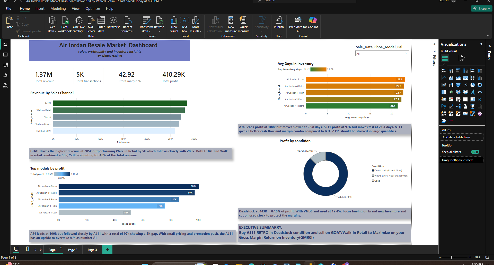
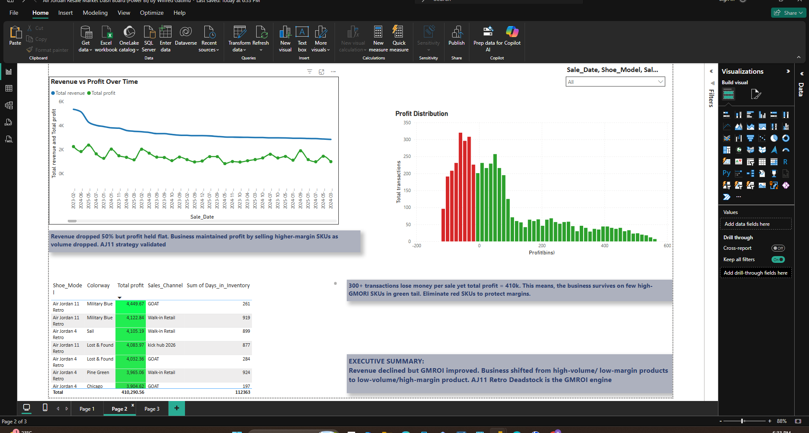
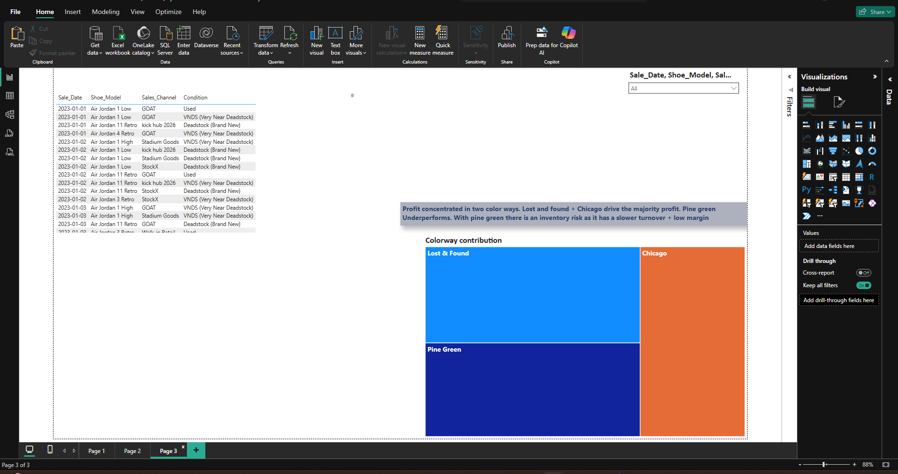

# jordan-resale-profit-analysis
Power BI analysis of $1.37M Air Jordan resale data. Found $410K profit at 42.9% margin despite 50% revenue drop. Identified AJ11 Retro Deadstock as GMROI engine. Dashboard covers profit drivers, inventory strategy, and SKU optimization.
 **Tool**: 
 SQL for data preparation | Power BI for analysis & visualization | **Data**  5K transactions, $1.37M revenue
 **Data prep**:
 Used SQL to clean and aggregate 5K transactions into an analysis-ready table
 **Analysis**: Built Power BI dashboard to identify GMROI drivers and inventory strategy
 3. **Insight**: Found $410K profit engine despite 50% revenue decline

### **Executive Summary**
Despite 50% revenue decline, maintained $410K profit at 42.92% margin by shifting to high-GMROI SKUs. 
**Key Finding**: 
AJ11 Retro Deadstock sold via GOAT is the optimal GMROI engine. Business carries 300+ money-losing transactions but survives on profitable long-tail.

### **Dashboard Breakdown**

#### **Page 1: Executive KPIs & Profit Drivers**
**Insights**
1. **Model Profit**:
2. AJ4 Retro leads at $100K, but AJ11 Retro at $97K moves 1.4 days faster.
3. AJ11 has better cash flow + margin combo for GMROI.
4. **Sales Channel**:
5. GOAT drives $285K revenue, outperforming Walk-in Retail by $5K. Combined they account for 40% of revenue.
6. **Condition**:
7. Deadstock = 87.6% of profit at $443K. VNDS + Used only 12.4%. 

#### **Page 2: GMROI Defense & Profit Distribution**

**Insights**
1. **Margin Defense**:
2. Revenue dropped 50% over time but profit held flat. Strategy shift to higher-margin SKUs validated.
3. **Profit Distribution**:
4. Histogram shows 300+ transactions lose money per sale. Green tail of high-profit transactions drives entire $410K profit.

#### **Page 3: Colorway Contribution**

**Insights**
1. **Lost & Found** and **Chicago** colorways dominate profit within AJ1 High and AJ4 Retro.
2. **Pine Green** shows high inventory levels but low profit contribution.

### **Business Impact**
**Recommendation**: 
Eliminate red SKUs losing money. Double down on AJ11 Military Blue/Lost & Found colorways sold via GOAT. Shift from volume-based to GMROI-based inventory strategy.

### **Skills Demonstrated**
Data Visualization, Business Intelligence, GMROI Analysis, Inventory Optimization, Executive Storytelling, Power BI, KPI Design
